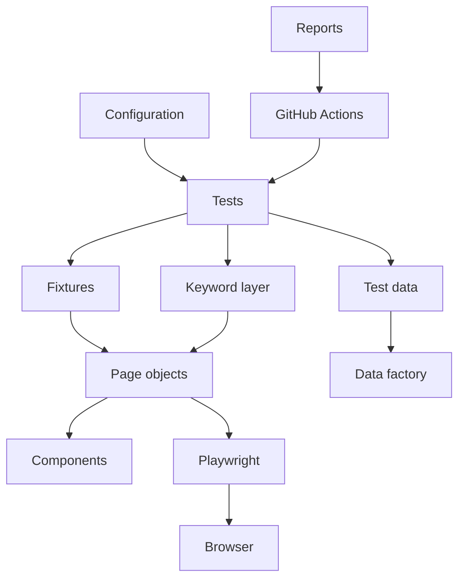

# Playwright + TypeScript QA Automation University

A **training course** and a **working test framework** in one repository.

You will automate the live practice form:

**[https://gitsuniversity.org/practice/registration-form/](https://gitsuniversity.org/practice/registration-form/)**

The same form evolves from a 10-line script into an enterprise-style suite. That continuity is the point.

| Audience | Start here |
| --- | --- |
| Brand-new student | [Lesson 00](docs/lessons/00-what-is-software-testing.md) |
| Manual tester new to code | [Lesson 03](docs/lessons/03-install-development-tools.md) then [Lesson 06](docs/lessons/06-navigate-to-the-registration-form.md) |
| Experienced SDET / architect | [Architecture overview](docs/architecture/overview.md) and [Lesson 56](docs/lessons/56-evolution-of-the-framework.md) |

---

## Table of contents

- [How to start on your laptop](#how-to-start-on-your-laptop)
- [Learning roadmap](#learning-roadmap)
- [PHASE 0 — Orientation](#phase-0--orientation)
- [PHASE 1 — Basic automation](#phase-1--basic-automation)
- [PHASE 2 — Core Playwright](#phase-2--core-playwright)
- [PHASE 3 — Maintainability](#phase-3--maintainability)
- [PHASE 4 — Reusability](#phase-4--reusability)
- [PHASE 5 — Data-driven automation](#phase-5--data-driven-automation)
- [PHASE 6 — Keyword-driven automation](#phase-6--keyword-driven-automation)
- [PHASE 7 — Advanced Playwright](#phase-7--advanced-playwright)
- [PHASE 8 — Git & GitHub](#phase-8--git--github)
- [PHASE 9 — CI/CD](#phase-9--cicd)
- [PHASE 10 — Enterprise framework architecture](#phase-10--enterprise-framework-architecture)
- [PHASE 11 — QA architect level](#phase-11--qa-architect-level)
- [TypeScript for QA (lessons 33–42)](#typescript-for-qa-lessons-3342)
- [Code quality (lessons 43–45)](#code-quality-lessons-4345)
- [Framework architecture](#framework-architecture)
- [Commands](#commands)
- [CI/CD](#cicd-github-actions)
- [Known limitations](#known-limitations)
- [Future learning](#future-learning)

Every deep lesson lives in [`docs/lessons/`](docs/lessons/) and uses the same 21-section teaching template (why, analogy, code, mistakes, quiz, interview questions, architect notes).

---

## How to start on your laptop

```bash
cd playwrightAutomationTutorialTS
npm install
npx playwright install chromium
npm test
```

You should see Chromium tests **pass**. Tests that actually click **Register** with a complete valid person are **skipped** unless you opt in:

```bash
RUN_REGISTRATION_SUBMISSION=true npm test
```

That flag exists so a classroom does not create dozens of practice accounts by accident.

Then open [Lesson 00](docs/lessons/00-what-is-software-testing.md).

---

## Learning roadmap

```text
Beginner     Lessons 00–16    Write a reliable Playwright test
Intermediate Lessons 17–32    Reuse: data, keywords, fixtures, reports
Advanced     Lessons 33–55    TypeScript, quality, Git, CI, governance
Architect    Lesson 56+       Design a suite that can grow
```

Teaching pattern for every abstraction:

```text
PROBLEM → WHY IT HURTS → SIMPLE SOLUTION → CODE → RESULT → ENTERPRISE VERSION
```

We do **not** start with enterprise folders. You feel the pain of a giant test first.

---

## PHASE 0 — Orientation

| Lesson | File |
| --- | --- |
| 00 What is software testing? | [docs/lessons/00-what-is-software-testing.md](docs/lessons/00-what-is-software-testing.md) |
| 01 What is test automation? | [docs/lessons/01-what-is-test-automation.md](docs/lessons/01-what-is-test-automation.md) |
| 02 The technology stack | [docs/lessons/02-technology-stack.md](docs/lessons/02-technology-stack.md) |
| 03 Install development tools | [docs/lessons/03-install-development-tools.md](docs/lessons/03-install-development-tools.md) |

---

## PHASE 1 — Basic automation

| Lesson | File | Practice code |
| --- | --- | --- |
| 04 Create the project | [04](docs/lessons/04-create-the-project.md) | this repo is already initialized |
| 05 Understand a Playwright test | [05](docs/lessons/05-understand-a-playwright-test.md) | `test('...', async ({ page }) => {})` |
| 06 Navigate to the form | [06](docs/lessons/06-navigate-to-the-registration-form.md) | [tests/01-basic/page-loads.spec.ts](tests/01-basic/page-loads.spec.ts) |

```bash
npx playwright test tests/01-basic/page-loads.spec.ts --project=chromium
```

---

## PHASE 2 — Core Playwright

| Lesson | File | Practice code |
| --- | --- | --- |
| 07 Web elements | [07](docs/lessons/07-understanding-web-elements.md) | textbox, combobox, checkbox, button |
| 08 Locators | [08](docs/lessons/08-playwright-locators.md) | [tests/02-locators/find-fields.spec.ts](tests/02-locators/find-fields.spec.ts) |
| 09 Fill the form (one file, on purpose) | [09](docs/lessons/09-fill-registration-form.md) | [tests/01-basic/fill-form.spec.ts](tests/01-basic/fill-form.spec.ts) |
| 10 Assertions | [10](docs/lessons/10-assertions.md) | [tests/03-assertions/field-values.spec.ts](tests/03-assertions/field-values.spec.ts) |

Locator preference (from the live DOM, including the required asterisk):

```text
getByRole('textbox', { name: 'First Name *' })
getByRole('button', { name: 'Register' })
```

before CSS or XPath. Use `{ exact: true }` on **Password \*** so it does not also match **Confirm Password \***.

---

## PHASE 3 — Maintainability

| Lesson | File |
| --- | --- |
| 11 Positive vs negative | [11](docs/lessons/11-positive-vs-negative-testing.md) |
| 12 Test case design | [12](docs/lessons/12-test-case-design.md) |
| 13 Why the first test is hard to maintain | [13](docs/lessons/13-why-the-first-test-is-hard-to-maintain.md) |

Documented scenarios: [docs/test-plan.md](docs/test-plan.md).

---

## PHASE 4 — Reusability

| Lesson | File | Practice code |
| --- | --- | --- |
| 14 Page Object Model | [14](docs/lessons/14-page-object-model.md) | [src/pages/RegistrationPage.ts](src/pages/RegistrationPage.ts) |
| 15 Refactor into POM | [15](docs/lessons/15-refactor-basic-test-into-pom.md) | [tests/04-pom/fill-with-pom.spec.ts](tests/04-pom/fill-with-pom.spec.ts) |
| 16 Component objects | [16](docs/lessons/16-component-object-model.md) | [src/components/HeaderComponent.ts](src/components/HeaderComponent.ts) |

Tests say **what**. The page object says **how**.

---

## PHASE 5 — Data-driven automation

| Lesson | File | Practice code |
| --- | --- | --- |
| 17 Hardcoded data hurts | [17](docs/lessons/17-why-hardcoded-test-data-is-a-problem.md) | — |
| 18 Typed data objects | [18](docs/lessons/18-typescript-test-data-objects.md) | [src/data/registration.data.ts](src/data/registration.data.ts) |
| 19 Multiple data sets | [19](docs/lessons/19-multiple-data-sets.md) | [tests/05-data-driven/validation.spec.ts](tests/05-data-driven/validation.spec.ts) |
| 20 JSON data | [20](docs/lessons/20-json-based-test-data.md) | [src/data/registration-users.json](src/data/registration-users.json) |
| 21 Data factory | [21](docs/lessons/21-test-data-factory.md) | [src/factories/registrationDataFactory.ts](src/factories/registrationDataFactory.ts) |

JSON is a tool, not a religion. TypeScript objects are often clearer for a small suite.

---

## PHASE 6 — Keyword-driven automation

| Lesson | File | Practice code |
| --- | --- | --- |
| 22 What is keyword-driven? | [22](docs/lessons/22-what-is-keyword-driven-automation.md) | mermaid in the lesson |
| 23 Type-safe keyword engine | [23](docs/lessons/23-type-safe-keyword-engine.md) | [src/keywords/KeywordRunner.ts](src/keywords/KeywordRunner.ts) |

```ts
await keywordRunner.execute([
  { keyword: 'ENTER_FIRST_NAME', value: 'John' },
  { keyword: 'ACCEPT_TERMS' },
]);
```

Use keywords when a product owner should read the test. Do **not** build a string-reflection engine.

---

## PHASE 7 — Advanced Playwright

| Lesson | File |
| --- | --- |
| 24 Fixtures | [24](docs/lessons/24-playwright-fixtures.md) |
| 25 `playwright.config.ts` | [25](docs/lessons/25-playwright-config.md) |
| 26 Environment variables | [26](docs/lessons/26-environment-variables.md) |
| 27 Smoke, regression, tags | [27](docs/lessons/27-smoke-regression-and-tags.md) |
| 28 Cross-browser | [28](docs/lessons/28-cross-browser-testing.md) |
| 29 Parallel execution | [29](docs/lessons/29-parallel-execution.md) |
| 30 Debugging | [30](docs/lessons/30-debugging-playwright.md) |
| 31 Trace viewer | [31](docs/lessons/31-trace-viewer.md) |
| 32 HTML reporting | [32](docs/lessons/32-html-reporting.md) |

Fixture file: [src/fixtures/test.fixture.ts](src/fixtures/test.fixture.ts).

---

## PHASE 8 — Git & GitHub

| Lesson | File |
| --- | --- |
| 46 Git fundamentals | [46](docs/lessons/46-git-fundamentals.md) |
| 47 Branching | [47](docs/lessons/47-branching-strategy.md) |
| 48 `.gitignore` | [48](docs/lessons/48-gitignore.md) |
| 49 Pull requests | [49](docs/lessons/49-pull-request-process.md) |
| 50 PR template | [50](docs/lessons/50-pull-request-template.md) |
| 51 CODEOWNERS | [51](docs/lessons/51-codeowners.md) |

Repo files: [.gitignore](.gitignore), [.github/pull_request_template.md](.github/pull_request_template.md), [.github/CODEOWNERS](.github/CODEOWNERS).

Replace `@YOUR_GITHUB_USERNAME` in CODEOWNERS before you rely on auto-reviewers.

---

## PHASE 9 — CI/CD

| Lesson | File |
| --- | --- |
| 52 CI/CD fundamentals | [52](docs/lessons/52-cicd-fundamentals.md) |
| 53 Playwright GitHub Actions | [53](docs/lessons/53-playwright-github-actions.md) |
| 54 CI optimization | [54](docs/lessons/54-ci-optimization.md) |
| 55 Protected main | [55](docs/lessons/55-protected-main-branch.md) |

Workflow: [.github/workflows/playwright.yml](.github/workflows/playwright.yml)

```text
PR / push → checkout → Node → npm ci → lint → typecheck → Chromium → tests → HTML report artifact
```

---

## PHASE 10 — Enterprise framework architecture

| Lesson | File |
| --- | --- |
| 56 Evolution of the framework | [56](docs/lessons/56-evolution-of-the-framework.md) |

Also: [docs/architecture/overview.md](docs/architecture/overview.md), [principles](docs/architecture/principles.md), [code review](docs/architecture/code-review.md).



---

## PHASE 11 — QA architect level

- [docs/architecture/principles.md](docs/architecture/principles.md) — DRY, KISS, YAGNI, SOLID only where useful, 5 → 5,000 tests
- [docs/assignments.md](docs/assignments.md) — classroom assignments 1–12 + capstone
- [docs/interview-questions.md](docs/interview-questions.md) — try first
- [docs/interview-answers.md](docs/interview-answers.md) — then check
- [docs/troubleshooting/README.md](docs/troubleshooting/README.md)

---

## TypeScript for QA (lessons 33–42)

[33 variables](docs/lessons/33-typescript-variables.md) · [34 primitives](docs/lessons/34-primitive-types.md) · [35 arrays](docs/lessons/35-arrays.md) · [36 objects](docs/lessons/36-objects.md) · [37 functions](docs/lessons/37-functions.md) · [38 interfaces](docs/lessons/38-interfaces.md) · [39 classes](docs/lessons/39-classes.md) · [40 async/await](docs/lessons/40-async-await.md) · [41 imports](docs/lessons/41-imports-exports.md) · [42 unions](docs/lessons/42-enums-vs-string-unions.md)

---

## Code quality (lessons 43–45)

[43 ESLint](docs/lessons/43-eslint.md) · [44 Prettier](docs/lessons/44-prettier.md) · [45 `tsc --noEmit`](docs/lessons/45-typescript-type-checking.md)

---

## Framework architecture

```text
src/pages/RegistrationPage.ts     how the form is operated
src/components/HeaderComponent.ts shared header
src/fixtures/test.fixture.ts      injects registrationPage
src/data/                         typed + JSON examples
src/factories/                    unique email/username
src/keywords/                     typed KeywordRunner
tests/01-basic → 06-keyword-driven  learning path (same form)
tests/smoke + tests/regression      production-style suites
```

Tests in `01-basic` through `03-assertions` talk to Playwright directly so you see the problem. From `04-pom` onward they use the shared framework.

---

## Commands

```bash
npm install
npx playwright install
npx playwright install chromium   # enough for the default npm test
npm test
npm run test:headed
npm run test:ui
npm run test:smoke
npm run test:regression
npm run test:firefox
npm run test:webkit
npm run typecheck
npm run lint
npm run format:check
npm run report
```

---

## CI/CD (GitHub Actions)

On every push and pull request to `main`/`master`:

1. Checkout
2. Setup Node (LTS) with npm cache
3. `npm ci`
4. `npm run lint`
5. `npm run typecheck`
6. Install Chromium with OS deps
7. `npx playwright test --project=chromium` with `RUN_REGISTRATION_SUBMISSION=false`
8. Upload `playwright-report/` as an artifact

---

## Known limitations

Observed on the live form (inspected 2026-09-11):

- Accessible names include a required asterisk (`First Name *`).
- Empty Register shows required messages for all fields **except Confirm Password** (no “confirm is required” when the form is empty).
- Custom messages verified: invalid email, username &lt; 5, password &lt; 8, mismatch, invalid phone, terms must be accepted, success title **Registration Successful**.
- Duplicate username/email persistence is **not verified** — do not automate it until you observe it.
- A site banner can cover **Register**; the page object uses `click({ force: true })`.
- `type=email` can show a **browser** tooltip; `novalidate` is applied so tests can see the page’s red text.
- Playwright is pinned to **1.57** so Chromium still installs on macOS 13.

---

## Future learning

Not built in this repo on purpose (YAGNI): API automation, storageState auth, axe accessibility audits, visual snapshots, Docker, cloud grids, performance, security scanning. See the last section of [Lesson 56](docs/lessons/56-evolution-of-the-framework.md).

Stuck? [docs/troubleshooting/README.md](docs/troubleshooting/README.md).
