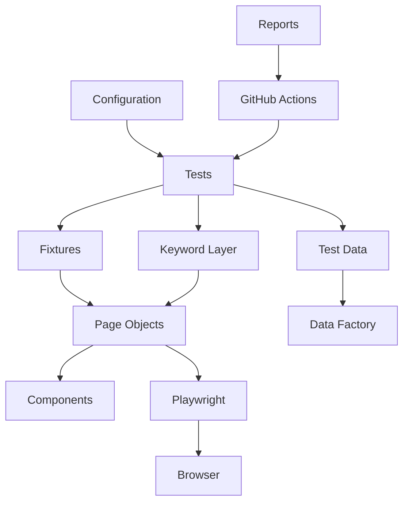

# Framework architecture

This repository’s production-style layout is a **layered** Playwright suite around the GITS registration form (`https://gitsuniversity.org/practice/registration-form/`) and a smaller to-do demo used earlier in the README.

Tests describe **what** to prove. They should not own locators, environment URLs, or GitHub usernames.

## Layer picture

## What each box does

| Box | Typical path | Job |
| --- | --- | --- |
| Tests | `tests/basic/`, `tests/e2e/` | Named scenarios, assertions, tags (`@smoke`) |
| Fixtures | `src/fixtures/` | Build `registrationPage` / keywords and `goto` the form |
| Pages | `src/pages/registration.page.ts` | Locators and screen actions |
| Components | `src/pages/components/` | Repeated widgets (used on the to-do screen) |
| Test data | `src/data/registration.data.ts`, `registration-error-cases.ts` | Shapes, valid person, required messages, negative rows |
| Data factory | `uniqueRegistrant()` in `registration.data.ts` | Unique email/username so parallel runs do not collide |
| Keywords | `src/keywords/registration.keywords.ts` | Business-named steps that call the page |
| Configuration | `playwright.config.ts`, `src/utils/env.ts`, `.env.example` | Timeouts, projects, `BASE_URL`, form URL |
| GitHub Actions | `.github/workflows/playwright.yml` | When the suite runs |
| Reports | `playwright-report/` (ignored in Git, uploaded in CI) | HTML, traces, screenshots |

## How a registration test travels

1. Spec imports `test` from `src/fixtures`.
2. Fixture constructs `RegistrationPage`, calls `goto()`.
3. Spec or keyword fills data from `src/data`.
4. Page talks to Playwright; Playwright drives Chromium.
5. `expect` stays in the test or in a keyword that is clearly an assertion step.

## Related docs

- [Principles](principles.md)
- [Code review](code-review.md)
- [Lesson 56 — Evolution](../lessons/56-evolution-of-the-framework.md)
- [Test plan](../test-plan.md)
