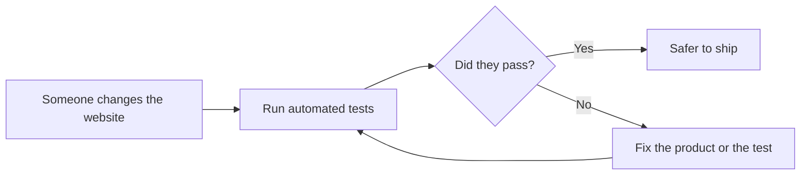

# Lesson 01 — What Is Test Automation?

## 1. What You Will Learn

You will explain test automation in plain English. You will see how Playwright repeats a registration checklist in a real browser. You will contrast a one-time manual check with a test you can run again after every change.

## 2. Why This Matters in Real Projects

**Problem:** a person can check the registration form once. A person cannot reliably recheck it after every small change.

**Why it hurts:** bugs sneak back in. Releases slow down because someone must click the same path by hand.

**Simple solution:** write the checklist once. Let a tool open the browser and follow it.

**Enterprise version:** the same suite runs on a robot computer (CI) on every pull request.

## 3. Concept in Plain English

Test automation is a script that does the clicks and checks a tester would do. You still decide **what** to check. The computer does **how**, the same way each time. Playwright is the tool this course uses: it opens Chromium, goes to the form, types, clicks **Register**, and reports pass or fail.



## 4. Real-Life Analogy

A smoke alarm is automation. You still care about fire. You do not stand in the hallway all night sniffing. The alarm repeats the check so you can sleep.

## 5. Prerequisites

[Lesson 00](00-what-is-software-testing.md). You have opened the live registration form once.

## 6. Files We Will Create or Modify

None. This lesson is the idea behind every `.spec.ts` file you will write.

## 7. Step-by-Step Instructions

1. Say the manual checklist out loud: open the form, see **Registration Form**, see the **Register** button.
2. Notice that those words can become a script.
3. Understand that the script is not “smarter” than you. It only repeats what you taught it.
4. Remember: if you teach it the wrong check, it will fail for the wrong reason.

## 8. Complete Code Example

```typescript
import { test, expect } from '@playwright/test';

test('the registration form loads', async ({ page }) => {
  await page.goto('https://gitsuniversity.org/practice/registration-form/');
  await expect(page.getByRole('heading', { name: 'Registration Form' })).toBeVisible();
});
```

## 9. Line-by-Line Explanation

`test` names one checklist item. `{ page }` is a fresh browser tab. `goto` opens the form. `expect(...).toBeVisible()` is the check: the heading a person would read must be on the screen. If it is missing, the test fails.

## 10. How to Run It

You will run files like this after the tools are installed (Lessons 03–04). The command shape is:

```bash
npx playwright test --headed
```

`--headed` means you watch the browser. That is the best way to learn.

## 11. Expected Result

The browser opens the form. The heading **Registration Form** is visible. The report says **passed**. If the site is down, the test **fails**, which is the correct signal.

## 12. Common Beginner Mistakes

- Thinking automation replaces thinking. It only repeats.
- Automating a check you have never done by hand.
- Expecting the tool to know the product’s rules. You must write them.

## 13. How to Debug It

Watch the headed run. Pause on the last screenshot in the HTML report. Read the exact assertion that failed, not the whole stack trace first.

## 14. Best Practices

Automate checks that you will need again: load, required fields, success. Keep each test’s story short enough to say in one sentence.

## 15. What NOT to Do

Do not automate random clicking “to see what happens.” Do not treat a green suite as proof that users are happy. Automation proves the checks you wrote, nothing more.

## 16. Hands-On Exercise

Write three checklist items for the form in English. Mark which ones are worth automating first (hint: page load and empty submit).

## 17. Challenge Exercise

Explain to a friend why running the same registration check after every change is cheaper than doing it only on release day.

## 18. Knowledge Check / Quiz (3-5 questions, answers at the bottom in a collapsed-style "Answers" section)

1. What does test automation repeat?
2. Who decides what a good result looks like?
3. What does a Playwright test file usually end with?
4. If the heading is missing, should the test pass or fail?

<details>
<summary>Answers</summary>

1. The clicks and checks a person already defined.
2. You (the tester), not the tool.
3. `.spec.ts` in this course.
4. Fail.

</details>

## 19. Interview Questions

1. What is the difference between manual testing and automated testing?
2. When should a team *not* automate a check?
3. What does “regression testing” mean in an automated suite?

## 20. Architect's Notes

Automation pays for itself when the same path is checked often. Registration is a high-value path. Start with a few stable checks. Add coverage after the suite is green and readable. A large, noisy suite is slower than a small, trusted one.

## 21. Next Lesson

Continue with [Lesson 02](02-technology-stack.md).
