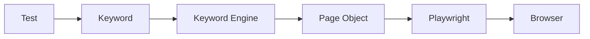

# Lesson 22 — What Is Keyword-Driven Automation?

## 1. What You Will Learn
- Explain **keyword-driven** testing in everyday words.
- See how a test, a keyword, a page object, and Playwright stack.
- Know the advantages — and **when not** to use this style.

## 2. Why This Matters in Real Projects
Manual testers often think in steps: “Enter first name. Click Register.” Keywords keep that language in code. Used well, they help reviews. Used poorly, they become a second programming language nobody wants to debug.

## 3. Concept in Plain English
A **keyword** is a named business step, such as `ENTER_FIRST_NAME` or “the person clicks Register.” The test lists keywords. A **keyword engine** runs them in order. Each keyword calls a **page object**, which talks to Playwright, which talks to the browser.

## 4. Real-Life Analogy
A restaurant ticket says “Make toast.” The kitchen knows that means: bread, toaster, plate. Guests never touch the toaster knobs. The ticket is the test. “Make toast” is the keyword. The toaster is Playwright.

## 5. Prerequisites
- [Lesson 21](21-test-data-factory.md).
- You have seen `RegistrationPage` methods like `fillForm` and `clickRegister`.

## 6. Files We Will Create or Modify
This lesson is mostly reading. You will **look at** (and later create):
| File | Role |
| --- | --- |
| `src/keywords/keyword.types.ts` | Allowed keyword names (Lesson 23) |
| `src/keywords/registrationKeywords.ts` | One function per step |
| `src/keywords/KeywordRunner.ts` | Engine that runs a list of steps |
| `src/pages/registration.page.ts` | Locators and clicks |

## 7. Step-by-Step Instructions
1. Write the story in business words: enter first name, enter email, click Register.
2. Give each step a stable name (`ENTER_FIRST_NAME`).
3. Implement the step on a page object (fill `#registration-form-firstname-input`).
4. Let the engine call steps in order.
5. Keep locators **out** of the test and **out** of the keyword names.

## 8. Complete Code Example
The layers, in order:



A tiny story (full type-safe engine is Lesson 23):

```typescript
await keywordRunner.execute([
  { keyword: 'ENTER_FIRST_NAME', value: 'John' },
  { keyword: 'CLICK_REGISTER' },
]);
```

## 9. Line-by-Line Explanation
- **Test** — which story are we proving?
- **Keyword** — what does the business call this step?
- **Keyword Engine** — run the list, in order, with type checks.
- **Page Object** — how this **screen** fills `firstName`.
- **Playwright** — `fill`, `click`, `expect`.
- **Browser** — Chromium (or Firefox/WebKit) on the registration URL.

## 10. How to Run It
No new command yet. Skim `src/pages/registration.page.ts`, then continue to Lesson 23 and run:

```bash
npx playwright test tests/e2e/registration.keywords.spec.ts --project=chromium
```

## 11. Expected Result
You can point at each box in the mermaid diagram and say what it owns. You do **not** put `#registration-form-submit-button` in the test file.

## 12. Common Beginner Mistakes
- Making a keyword that only wraps one `click()` with no business meaning.
- Putting CSS ids inside keyword files.
- Building a giant Excel sheet of keywords before page objects exist.

## 13. How to Debug It
If a keyword fails, open the page object method it calls. Use `--debug` on the spec, not on the mermaid. Trace viewer (Lesson 31) shows the click, not the keyword name, unless you log steps.

## 14. Best Practices
- Page objects first; keywords when tests should read like a manual.
- Stable names (`ENTER_FIRST_NAME`), not `fillBox1`.
- One engine, typed keyword names (next lesson).

## 15. What NOT to Do
Do **not** use a keyword engine when:
- the suite is tiny (a handful of specs) and page objects already read clearly;
- every “keyword” would be a single Playwright line;
- the team would have to learn your engine instead of TypeScript;
- you are tempted to look up methods by **string reflection** (`this[name]()`);
- product owners will never read the tests anyway.

Keywords are a communication tool. If nobody reads them, they are extra moving parts.

## 16. Hands-On Exercise
On paper, list five registration steps as keyword names. Match each to a method on `RegistrationPage` (`firstName.fill`, `clickRegister`).

## 17. Challenge Exercise
Rewrite one existing test in `tests/e2e/registration.spec.ts` as a bullet list of keywords only — no locators. Tomorrow you will run that list for real.

## 18. Knowledge Check / Quiz
1. What does the page object own that the keyword must not own?
2. What sits between Keyword and Page Object in the diagram?
3. Name one good reason **not** to use keyword-driven tests.

### Answers
1. Locators and low-level clicks (`#registration-form-firstname-input`).
2. The Keyword Engine.
3. Small suite, single-click wrappers, or a team that will not maintain the engine.

## 19. Interview Questions
1. Explain keyword-driven testing versus data-driven testing.
2. How do keywords, page objects, and Playwright divide responsibility?
3. When would you advise a team against a keyword engine?

## 20. Architect's Notes
Keyword-driven automation is **not** a replacement for POM, fixtures, or TypeScript. It is a thin story layer. The next lesson makes the engine **type-safe**: allowed keyword names are a union type, and the runner uses `switch` — never reflection. That is what keeps a Robot-style table from becoming `any`.

## 21. Next Lesson
[Lesson 23 — Type-Safe Keyword Engine](23-type-safe-keyword-engine.md)
