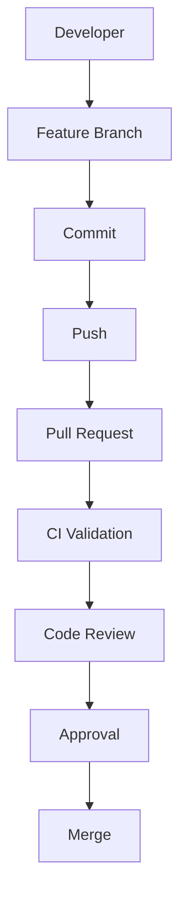

# Lesson 49 — Pull Request Process

## 1. What You Will Learn
- What a **pull request (PR)** is
- The path from a feature branch to merge
- How CI and reviewers fit in that path

## 2. Why This Matters in Real Projects
Nobody should paste a new locator straight onto `main`. A PR is a **conversation plus evidence**: what changed, why, which registration tests you ran, and whether GitHub Actions is green. That conversation is how juniors learn and how architecture stays honest.

## 3. Concept in Plain English
You finished work on a branch. A pull request asks the team to **pull** those commits into `main`. GitHub shows the diff, runs checks, and records approvals. Merge copies the commits onto `main`.

## 4. Real-Life Analogy
You submit a lab report. The teacher (reviewer) comments. The lab computer (CI) reruns the experiment. Only then does the report enter the course binder (`main`).

## 5. Prerequisites
- [Lesson 47](47-branching-strategy.md)
- A GitHub remote for this repo

## 6. Files We Will Create or Modify
- None required for the process itself
- Related: `.github/pull_request_template.md` (Lesson 50), `.github/CODEOWNERS` (Lesson 51)

## 7. Step-by-Step Instructions
1. Push your feature branch.
2. Open a PR targeting `main`.
3. Fill the template (summary, test plan).
4. Wait for GitHub Actions (lint, typecheck, Playwright).
5. Address review comments.
6. Get approval. Merge. Delete the branch.

## 8. Complete Code Example



## 9. Line-by-Line Explanation
- **Developer** writes tests on a branch, not on `main`.
- **Commit / Push** make the work visible on GitHub.
- **PR** is the review surface.
- **CI** reruns `npm ci`, lint, typecheck, Chromium tests.
- **Review** checks locators, data, and isolation — not only a green check.
- **Approval / Merge** are explicit. Red CI should block merge (Lesson 55).

## 10. How to Run It
On GitHub: **Compare & pull request**. Locally you can also run:

```bash
gh pr create --fill
```

## 11. Expected Result
The PR page shows the diff, the workflow run, requested reviewers (from CODEOWNERS), and a merge button that stays disabled until checks and reviews pass (when `main` is protected).

## 12. Common Beginner Mistakes
- Opening a PR with failing tests “for later”
- Empty description (“please review”)
- Merging your own PR with no second pair of eyes on page objects

## 13. How to Debug It
If CI is red, open the Actions log before pinging a reviewer. If the PR has no reviewers, check CODEOWNERS paths. If you cannot merge, read the required checks list on the PR.

## 14. Best Practices
- One concern per PR
- Link a ticket when you have one
- Re-run failed jobs after a flake investigation — do not merge on “it passed locally”

## 15. What NOT to Do
- Do not force-push to `main`
- Do not include `.env` or screenshots of passwords
- Do not use the PR as a dump of ten unrelated lessons

## 16. Hands-On Exercise
Walk the mermaid diagram aloud using a real change: “empty form does not require Confirm Password.”

## 17. Challenge Exercise
Write a six-sentence PR summary for adding `RUN_REGISTRATION_SUBMISSION` gating around the success test.

## 18. Knowledge Check / Quiz
1. What does CI do on a PR?
2. Who merges — the developer alone, or after approval?
3. What comes first: push or pull request?

**Answers:** 1) Installs, lints, typechecks, tests 2) After review/approval when rules require it 3) Push the branch, then open the PR.

## 19. Interview Questions
1. What happens during a pull request?
2. Why run CI on PRs instead of only on `main`?
3. How do you keep PRs reviewable as a suite grows?

## 20. Architect's Notes
The PR is the last cheap place to stop a God page object, a hard wait, or an ungated loop that creates thousands of accounts. Treat merge as a product decision, not a courtesy.

## 21. Next Lesson
[Lesson 50 — Pull Request Template](50-pull-request-template.md)
