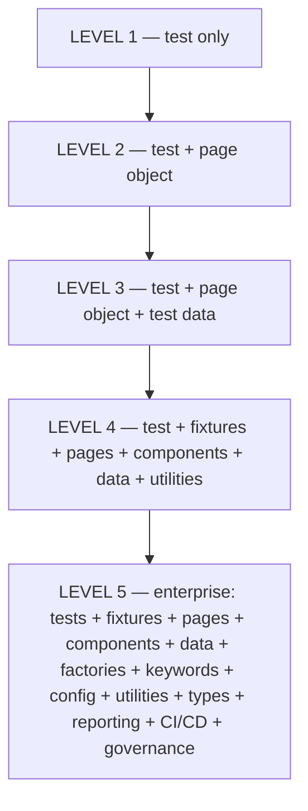

# Lesson 56 — Evolution of the Framework

## 1. What You Will Learn
- How the same registration form grew from one test to an enterprise-shaped suite
- What each layer is **for**
- When **not** to skip to Level 5 on day one

## 2. Why This Matters in Real Projects
Companies fail in two ways: a 5,000-line spec with no pages, or a keyword engine with three tests. You now have language for the middle path: add a layer when the **pain** appears.

## 3. Concept in Plain English
A **layer** is a folder with a job. Tests say what to prove. Pages click. Data holds values. Fixtures hand you ready objects. Keywords name business steps. CI and governance decide when the machine runs and who may merge.

## 4. Real-Life Analogy
Level 1 is cooking every meal from memory in one pot. Level 5 is a restaurant: recipes, stations, suppliers, inspectors. You do not build a restaurant to toast bread once. You do not keep one pot when you serve 500 people.

## 5. Prerequisites
- Lessons 14–25 (POM, data, keywords, fixtures) and 46–55 (Git and CI)

## 6. Files We Will Create or Modify
- None — this lesson is a map of what you already built
- See [docs/architecture/overview.md](../architecture/overview.md)

## 7. Step-by-Step Instructions
1. Read the mermaid diagram from top to bottom.
2. For each level, name one file in **this** repo that belongs there.
3. Ask: which pain forced the next level? (Copy-paste locators → POM; colliding emails → factory; unreadable stories → keywords.)

## 8. Complete Code Example



## 9. Line-by-Line Explanation
- **LEVEL 1** — `tests/basic/registration-heading.spec.ts`. Learn `goto` and `expect`.
- **LEVEL 2** — `src/pages/registration.page.ts`. Locators change once.
- **LEVEL 3** — `src/data/registration.data.ts` and error-case tables. Data is not hardcoded in the spec.
- **LEVEL 4** — fixtures inject `registrationPage`; components exist where widgets repeat; `src/utils/env.ts` for URLs.
- **LEVEL 5** — factories (`uniqueRegistrant`), keywords, `playwright.config.ts`, HTML reports, GitHub Actions, CODEOWNERS, PR template, protected `main`.

## 10. How to Run It
You do not run this lesson. You **recognize** it:

```bash
npx playwright test tests/e2e/registration.spec.ts --project=chromium
```

## 11. Expected Result
You can point at a failing test and say which layer should change. A heading rename is the page. A new invalid-email sentence is data. A CI skip is governance.

## 12. Common Beginner Mistakes
- Starting at Level 5 because a blog showed a folder tree
- Stopping at Level 1 because “it works”
- Adding keywords that only wrap a single `click`

## 13. How to Debug It
If you cannot tell which layer owns a bug, the seams leaked. Draw the diagram, put the file on it, and move the logic. Flakes are often Level 1 waits or shared data, not “need more folders.”

## 14. Best Practices
- Experience the problem, then add the layer
- Keep tests readable at every level
- Gate account-creating success tests (`RUN_REGISTRATION_SUBMISSION`)

## 15. What NOT to Do
- Do not duplicate a second “demo” framework that will rot
- Do not wrap every Playwright API in an empty helper
- Do not automate duplicate-username until the live app is observed

## 16. Hands-On Exercise
Write five bullets: one file per level in this repository.

## 17. Challenge Exercise
Design Level 6 on paper (API checks, accessibility audit, visual snapshots). Do not implement it in this course.

## 18. Knowledge Check / Quiz
1. Which level introduces page objects?
2. Which level adds CI and CODEOWNERS?
3. Why not start at Level 5?

**Answers:** 1) Level 2 2) Level 5 3) You would not understand which pain each folder solves.

## 19. Interview Questions
1. How would you evolve a Playwright suite from 5 tests to 5,000?
2. What layer owns locators vs data vs when tests run?
3. How do you decide a new abstraction is justified?

## 20. Architect's Notes
The registration form never changed its job: prove the page. The **surroundings** changed. That is enterprise architecture for QA: same product, stronger seams, cheaper change, safer merge. Read [docs/architecture/principles.md](../architecture/principles.md) next as a working reference, not as a new lesson.

## 21. Next Lesson
You finished the course. See README assignments and [docs/architecture/](../architecture/).
